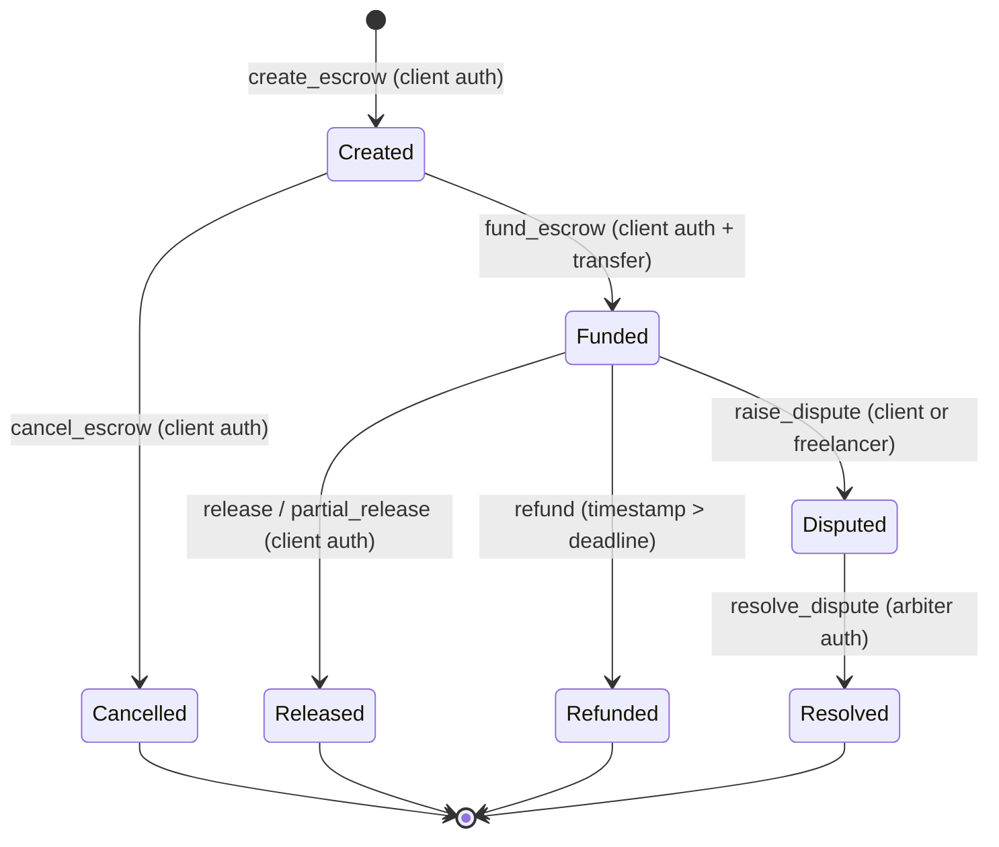

# Escrow Status Enum and Lifecycle Transitions

This document provides a detailed reference for all escrow lifecycle statuses, transition rules, authorization invariants, and terminal states in the Stellar Escrow protocol.

---

## 1. Status Enum Definition

```rust
#[contracttype]
#[derive(Clone, Debug, PartialEq, Eq)]
pub enum EscrowStatus {
    Created,
    Funded,
    Released,
    Refunded,
    Disputed,
    Resolved,
    Cancelled,
}
```

---

## 2. Status Specifications

### `Created`
- **Type**: Non-Terminal (Initial State)
- **Entry Condition**: Executed via `create_escrow` by the `client`. Record stored with positive amount and future deadline.
- **Valid Outgoing Transitions**:
  - `-> Cancelled`: Client cancels before depositing tokens.
  - `-> Funded`: Client deposits the required token amount.
- **Allowed Actions**: `cancel_escrow`, `update_arbiter`, `fund_escrow`.

---

### `Funded`
- **Type**: Non-Terminal (Active Locked State)
- **Entry Condition**: Executed via `fund_escrow` by the `client`. Token amount transferred from client to contract account.
- **Valid Outgoing Transitions**:
  - `-> Released`: Client approves work and releases funds (full or partial).
  - `-> Refunded`: Deadline expires and refund is triggered.
  - `-> Disputed`: Client or freelancer opens a dispute.
- **Allowed Actions**: `release`, `partial_release`, `refund` (after deadline), `raise_dispute`.

---

### `Released`
- **Type**: Terminal State
- **Entry Condition**: Executed via `release` or `partial_release` by the `client`. Funds transferred to freelancer (and partial remainder to client).
- **Valid Outgoing Transitions**: None.
- **Allowed Actions**: Read-only queries.

---

### `Refunded`
- **Type**: Terminal State
- **Entry Condition**: Executed via `refund` after `env.ledger().timestamp() > escrow.deadline`. Funds returned to client. Callable permissionlessly.
- **Valid Outgoing Transitions**: None.
- **Allowed Actions**: Read-only queries.

---

### `Disputed`
- **Type**: Non-Terminal (Arbitration State)
- **Entry Condition**: Executed via `raise_dispute` by either `client` or `freelancer`.
- **Valid Outgoing Transitions**:
  - `-> Resolved`: Designated `arbiter` decides winner.
- **Allowed Actions**: `resolve_dispute` (authorized by `arbiter`).

---

### `Resolved`
- **Type**: Terminal State
- **Entry Condition**: Executed via `resolve_dispute` by `arbiter`. Full escrow funds awarded and transferred to chosen winner (`client` or `freelancer`).
- **Valid Outgoing Transitions**: None.
- **Allowed Actions**: Read-only queries.

---

### `Cancelled`
- **Type**: Terminal State
- **Entry Condition**: Executed via `cancel_escrow` by `client` while in `Created` status. No token transfer occurs.
- **Valid Outgoing Transitions**: None.
- **Allowed Actions**: Read-only queries.

---

## 3. Transition Matrix

| From \ To | `Created` | `Funded` | `Released` | `Refunded` | `Disputed` | `Resolved` | `Cancelled` |
| :--- | :---: | :---: | :---: | :---: | :---: | :---: | :---: |
| **`Created`** | — | ✓ (`fund_escrow`) | ✗ | ✗ | ✗ | ✗ | ✓ (`cancel_escrow`) |
| **`Funded`** | ✗ | — | ✓ (`release`) | ✓ (`refund`) | ✓ (`raise_dispute`) | ✗ | ✗ |
| **`Disputed`** | ✗ | ✗ | ✗ | ✗ | — | ✓ (`resolve_dispute`) | ✗ |
| **`Released`** | ✗ | ✗ | — | ✗ | ✗ | ✗ | ✗ |
| **`Refunded`** | ✗ | ✗ | ✗ | — | ✗ | ✗ | ✗ |
| **`Resolved`** | ✗ | ✗ | ✗ | ✗ | ✗ | — | ✗ |
| **`Cancelled`**| ✗ | ✗ | ✗ | ✗ | ✗ | ✗ | — |

---

## 4. State Diagram


